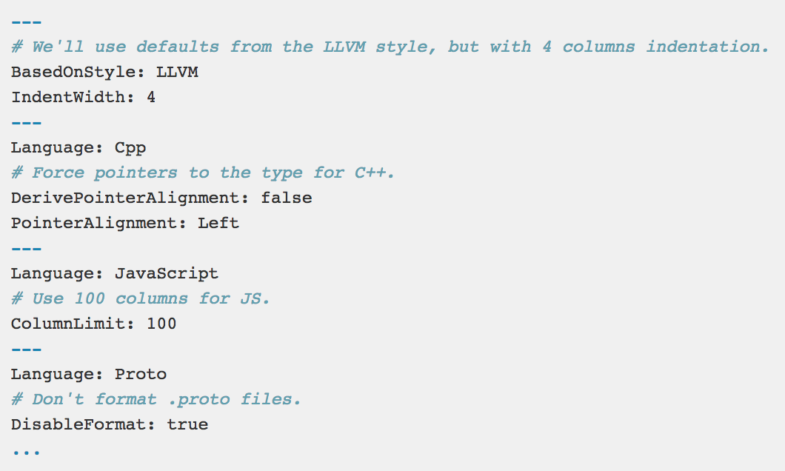
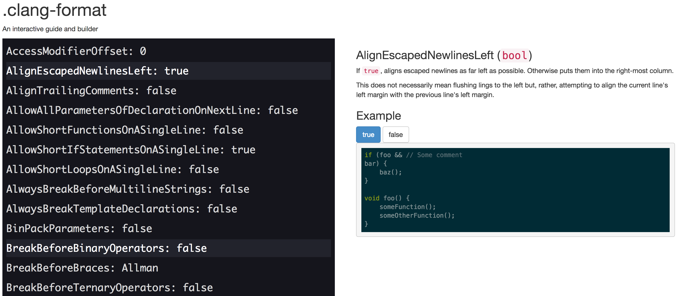

footer: **iOS projects code formatting** - Eduard Panasiuk - https://github.com/somedev

#iOS projects code formattings
### Eduard Panasiuk

---

#Tools

* [ClangFormat](https://clang.llvm.org/docs/ClangFormat.html)

* [SwiftFormat](https://github.com/nicklockwood/SwiftFormat)

* [SwiftLint](https://github.com/realm/SwiftLint)

---

#ClangFormat
^ на основе библиотеки LibFormat
^ фигурные скобки, отступы от скобок и названий перменных, выравнивание списка переменных (`=`), лимит по ширине, пробелы просле property, звездочка для указателя, сортировка импортов, отступы в макросах, внутри функций, скоупов, switch/case
^ не поддерживает Swift пока

---

#ClangFormat

[https://clang.llvm.org/docs/ClangFormat.html](https://clang.llvm.org/docs/ClangFormat.html)
<br>
**Instalation:**

```bash
brew install clang-format
```
**Usage:**

```bash
clang-format -style=file ./MyClass.m
```

---

#ClangFormat options

[https://clang.llvm.org/docs/ClangFormatStyleOptions.html](https://clang.llvm.org/docs/ClangFormatStyleOptions.html)   



---

#ClangFormat predefined styles

<br>

**LLVM**, **Google**, **Chromium**, **Mozilla**, **WebKit**

<br>

**Dump predefined style:**

```bash
clang-format -style=llvm -dump-config > .clang-format
```

---

#ClangFormat options

[https://clangformat.com/](https://clangformat.com/)



---

#ClangFormat usage

**Git hook**

Create `.git/hooks/pre-commit`

```bash
    #!/bin/bash

    CLANG_FORMAT=$(which clang-format)

    git diff-index --cached --diff-filter=ACMR --name-only $against -- | while read file;
	do
        "$CLANG_FORMAT" -i -style=file "$file"
        git add "$file"
    done
```

---

#SwiftFormat

^ от Nick Lockwood - автор  iCarousel, активно поддерживается
^ можно посмотреть исходники - как написать свой парсер языка
^ включает/выключает self внутри класса для методов и переменных, фигурные скобки, отступы от скобок и названий перменных, убирает дупликаты импорта, сортировка импорта, убирает/переписывает хедеры, убирает лишние скобки, точки с запятой, лишние переменные

---

#SwiftFormat

[https://github.com/nicklockwood/SwiftFormat](https://github.com/nicklockwood/SwiftFormat)

**Instalation:**

```bash
brew install swiftformat
```


---

#SwiftFormat usage

**Terminal**

Run in project directory:

```bash
swiftformat .
```

---

#SwiftFormat options

[https://github.com/nicklockwood/SwiftFormat](https://github.com/nicklockwood/SwiftFormat/blob/master/README.md)

```
--allman           use allman indentation style. "true" or "false" (default)
--binarygrouping   binary grouping,threshold or "none", "ignore". default: 4,8
--commas           commas in collection literals. "always" (default) or "inline"
--comments         indenting of comment bodies. "indent" (default) or "ignore"
--decimalgrouping  decimal grouping,threshold or "none", "ignore". default: 3,6
--elseposition     placement of else/catch. "same-line" (default) or "next-line"
--empty            how empty values are represented. "void" (default) or "tuple"
--experimental     experimental rules. "enabled" or "disabled" (default)
--exponentcase     case of 'e' in numbers. "lowercase" or "uppercase" (default)
--header           header comments. "strip", "ignore", or the text you wish use
--hexgrouping      hex grouping,threshold or "none", "ignore". default: 4,8
--hexliteralcase   casing for hex literals. "uppercase" (default) or "lowercase"
--ifdef            #if indenting. "indent" (default), "noindent" or "outdent"
--indent           number of spaces to indent, or "tab" to use tabs
--indentcase       indent cases inside a switch. "true" or "false" (default)
--linebreaks       linebreak character to use. "cr", "crlf" or "lf" (default)
--octalgrouping    octal grouping,threshold or "none", "ignore". default: 4,8
--operatorfunc     spacing for operator funcs. "spaced" (default) or "nospace"
--patternlet       let/var placement in patterns. "hoist" (default) or "inline"
--ranges           spacing for ranges. "spaced" (default) or "nospace"
--semicolons       allow semicolons. "never" or "inline" (default)
--self             use self for member variables. "remove" (default) or "insert"
--stripunusedargs  "closure-only", "unnamed-only" or "always" (default)
--trimwhitespace   trim trailing space. "always" (default) or "nonblank-lines"
--wraparguments    wrap function args. "beforefirst", "afterfirst", "disabled"
--wrapelements     wrap array/dict. "beforefirst", "afterfirst", "disabled"
```

---
#SwiftFormat options

**Enable/Disable rules for concrete file**


```swift
// swiftformat:disable <rule1> [<rule2> [rule<3> ...]]
```

```swift
// swiftformat:enable <rule1> [<rule2> [rule<3> ...]]
```

---

#SwiftFormat usage

**Xcode build phase**

Install pod:

```ruby
pod 'SwiftFormat/CLI'
```

Add build phase:

```bash
"${PODS_ROOT}/SwiftFormat/CommandLineTool/swiftformat"
```

---

#SwiftFormat usage

**Git hook**

Create `.git/hooks/pre-commit`

```bash
   #!/bin/bash
   git diff --staged --name-only | grep -e '\(.*\).swift$' | while read file; do
      swiftformat ${file};
      git add $file;
   done
```

---


#Swift linters

[Tailor - Cross-platform static analyzer and linter for Swift](https://github.com/sleekbyte/tailor)
<br>
[SwiftLint - Swift linter](https://github.com/realm/SwiftLint)

---

#SwiftLint

^ проверка стиля и анализ кода, генерация Error/Warning
^ использует Clang и SourceKit

---

#SwiftLint

**Instalation:**

```bash
brew install swiftlint
```

```bash
pod 'SwiftLint'
```

---

#SwiftLint usage

**Xcode build phase**

Install pod:

```ruby
pod 'SwiftLint'
```

Add build phase:

```bash
"${PODS_ROOT}/SwiftLint/swiftlint autocorrect"
```

---

#SwiftLint usage

**Fastlane**


```ruby
swiftlint(
    mode: :lint,                            # SwiftLint mode: :lint (default) or :autocorrect
    executable: "Pods/SwiftLint/swiftlint", # The SwiftLint binary path (optional). Important if you've installed it via CocoaPods
    path: "/path/to/lint",                  # Specify path to lint (optional)
    output_file: "swiftlint.result.json",   # The path of the output file (optional)
    reporter: "json",                       # The custom reporter to use (optional)
    config_file: ".swiftlint-ci.yml",       # The path of the configuration file (optional)
    files: [                                # List of files to process (optional)
        "AppDelegate.swift",
        "path/to/project/Model.swift"
    ],
    ignore_exit_status: true,               # Allow fastlane to continue even if SwiftLint returns a non-zero exit status (Default: false)
    quiet: true,                            # Don't print status logs like 'Linting ' & 'Done linting' (Default: false)
    strict: true                            # Fail on warnings? (Default: false)
)
```


---

#SwiftLint

[Supported rules](https://github.com/realm/SwiftLint/blob/master/Rules.md)

`.swiftlint.yml` in project directory

Supports nested configurations (`.swiftlint.yml` in directory structure)

^ отступы, пробелы, перенос строки
^ включение/выключение правил  форматирования в коде

---

#SwiftLint

**Custom rules**

```yml
custom_rules:
  pirates_beat_ninjas: # rule identifier
    included: ".*\\.swift" # regex that defines paths to include during linting. optional.
    excluded: ".*Test\\.swift" # regex that defines paths to exclude during linting. optional
    name: "Pirates Beat Ninjas" # rule name. optional.
    regex: "([n,N]inja)" # matching pattern
    match_kinds: # SyntaxKinds to match. optional.
      - comment
      - identifier
    message: "Pirates are better than ninjas." # violation message. optional.
    severity: error # violation severity. optional.
  no_hiding_in_strings:
    regex: "([n,N]inja)"
    match_kinds: string
```

---

#iOS projects code formattings
### Eduard Panasiuk
